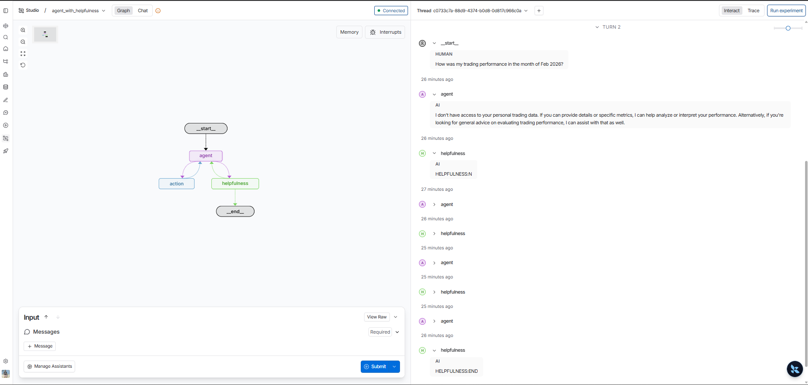
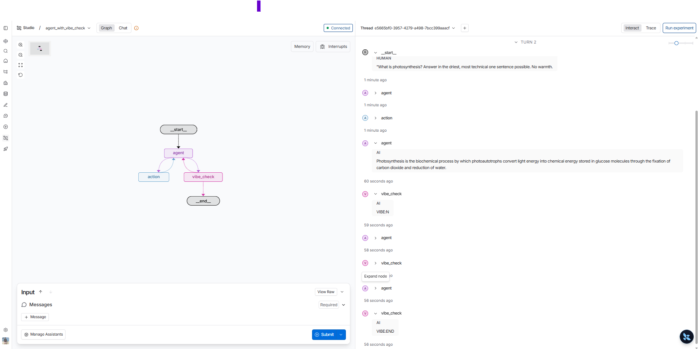

<p align = "center" draggable="false" >
</p>

## <h1 align="center" id="heading">Session 15: Build & Serve Agentic Graphs with LangGraph</h1>

| 📰 Session Sheet                                             | ⏺️ Recording                           | 🖼️ Slides                                  | 👨‍💻 Repo    | 📝 Homework                                      | 📁 Feedback                                          |
| ------------------------------------------------------------ | -------------------------------------- | ------------------------------------------- | ------------- | ------------------------------------------------ | ---------------------------------------------------- |
| [Agent Servers](https://github.com/AI-Maker-Space/AIE9/tree/main/00_Docs/Session_Sheets/15_Agent_Servers) |[Recording!](https://us02web.zoom.us/rec/share/lORjByDju6fv4TdE3r93dorY3aNgmSKL_Qk_cX_AMcCQ6cNfSW77unaA1LMVV60.OcI8uEnfVmRAgjSn) <br> passcode: `Dc@&pv1T`| [Session 15 Slides](https://www.canva.com/design/DAG-EJqkRaM/FR3WG_yMA5_BqbWpQlHR9g/edit?utm_content=DAG-EJqkRaM&utm_campaign=designshare&utm_medium=link2&utm_source=sharebutton) | You are here! | [Session 15 Assignment: Agent Servers](https://forms.gle/Vb3HNDsyVPQ1jqKX7) | [Feedback 3/3](https://forms.gle/kYmhbVUEMog16mKv8) |

### Prerequisites

Before starting, ensure you have the following:

- **Python 3.11+** installed
- An **OpenAI API Key**
- A **Tavily API Key**
- (Optional) **LangSmith** credentials for tracing

Create a `.env` file in this directory with your API keys:
   ```
   OPENAI_API_KEY=your_openai_api_key_here
   TAVILY_API_KEY=your_tavily_api_key_here
   ```
2. Run `uv sync` to install dependencies.

# Build 🏗️

Run the repository and complete the following:

- 🤝 Breakout Room Part #1 — Building and serving your LangGraph Agent Graph
  - Task 1: Getting Dependencies & Environment
    - Configure `.env` (OpenAI, Tavily, optional LangSmith)
  - Task 2: Serve the Graph Locally
    - `uv run langgraph dev` (API on http://localhost:2024)
  - Task 3: Call the API from a different terminal
    - `uv run test_served_graph.py` (sync SDK example)
  - Task 4: Explore assistants (from `langgraph.json`)
    - `agent` → `simple_agent` (tool-using agent)
    - `agent_helpful` → `agent_with_helpfulness` (separate helpfulness node)

- 🤝 Breakout Room Part #2 — Using LangSmith Studio to visualize the graph
  - Task 1: Open Studio while the server is running
    - https://smith.langchain.com/studio?baseUrl=http://localhost:2024
  - Task 2: Visualize & Stream
    - Start a run and observe node-by-node updates
  - Task 3: Compare Flows
    - Contrast `agent` vs `agent_helpful` (tool calls vs helpfulness decision)

<details>
<summary>🚧 Advanced Build 🚧 (OPTIONAL - <i>open this section for the requirements</i>)</summary>

>NOTE: This can be done in place of the Main Assignment

- Create and deploy a locally hosted MCP server with FastMCP.
- Extend your tools in `tools.py` to allow your LangGraph to consume the MCP Server.

When submitting, provide:
- Your Loom video link demonstrating the MCP server integration
- The GitHub URL to your completed Advanced Build

Have fun!
</details>

### Questions & Activities

#### Question 1:
What is the key architectural difference between the `simple_agent` and `agent_with_helpfulness` graphs? Specifically, explain how the helpfulness evaluation loop works and what mechanisms are in place to prevent it from running indefinitely.

##### Answer:
|Aspect|simple_agent|agent_with_helpfulness|
|------|------------|----------------------|
|When agent gives a final reply|Graph ends right away|Reply is sent to helpfulness evaluator|
|Quality gate|None|Extra LLM call via helpfulness agent to judge if the simple_agent answer was helpful|
|Loop|Only between agent & tools|Loop between agent & tools and simple_agent & helpfulness_agent, retries until answer is helpful or limit reach|
|Loop Limit| NA|10 messages limit in the state then force to END|

So the key architectural difference between the `simple_agent` and `agent_with_helpfulness` graphs is simple_agent is a single pass agent with tools whereas helpfulness_agent adds a post response helpfulness evaluation and a bounded retry loop so to improve the answer until it is judged helpful or the retry limit is reached.

The helpfulness evaluation loop works as below
1. When the agent returns a mesage without tool calls, route_to_action_or_helpfulness sends control to the helpfulness node.
2. Helpfulness node check if the eval loop has hit the max limit defined by checking the length of messages in state is greater 10, if yes, it immediately returns the message and ends the loop.
Otherwise, it takes the first message as the initial query and the last message as the final response, runs another LLM call with structured output (is_helpful) and then appends either AIMessage(content="HELPFULNESS:Y) or AIMessage(content="HELPFULNESS:N)
3. helpfulness_decision now looks at the last messages's content
  - if it contains "HELPFULNESS:END" then ends the loop and graph terminates.
  - if it contains "HELPFULNESS:Y" then returns 'end' and the graph terminates
  - if it contains "HELPFULNESS:N" then return 'continue' and the graph runs the agent node again.

The explicit guard to check if there are more than 10 messages in the state, prevents the (agent -> helpfulness_agent -> agent) loop from running indefinitely.

Example screenshot where the helpfulness agent ran and ends the loop after the max limit is hit



#### Question 2:
What is the role of `langgraph.json` in the LangGraph Deployments? Describe each of its key fields and how the platform uses this file to discover and serve your graphs.

##### Answer:
`langgraph.json` tells LangGraph where the graphs live, which python/env to use, where to get the dependencies and env variables from and how to wire the graphs to assistants and run the local deployment.

Key fields in the json file and how it is used as below
|Field|Purpose|How the platform uses it|
|-----|-------|------------------------|
|version|Config schema version example: 1|Tells the platform which config format to expect so it can parse the file correctly|
|dependencies|List of dependency locations (e.g. ["."] = project root).|Used to install or resolve packages, so your graphs run with the right environment|
|env|Path to the env file (example: ".env")|Loaded when the server starts so API keys and other secrets are available to the graphs|
|pythoon_version|Target Python version (example: "3.10")|Used to select the runtime so graphs run on the specified Python version|
|graphs|Map graph IDs -> graph entrypoints|the platform imports each path (example: app.graphs.simple_agent:graph), gets the compiled graph object, and registers it under the given ID. The API and Studio then serve these graphs by ID|
|assistants|Map of assistant IDs → assistant config|Each assistant has a graph_id (which graph to run), plus name and description for the GUI. The platform exposes assistants in Studio and/or the API so users can start runs by assistant instead of raw graph IDs|


#### Activity #1:
Create your own agent graph! Build a new graph in `app/graphs/` with a custom evaluation node (e.g., a vibe checker, a fact verifier, a summarizer — get creative!). Register it in `langgraph.json`, serve it with `uv run langgraph dev`

##### Answer:
I have added a new graph **`agent_with_vibe_check`** in `app/graphs/agent_with_vibe_check.py` with a custom **vibe-check** evaluation node. The flow mirrors `agent_with_helpfulness` but evaluates whether the agent's final reply has a **friendly, positive and approachable tone** (warmth, politeness, welcoming). The vibe node uses an LLM with structured output (`VibeResult.is_friendly`). If the tone is friendly → graph ends; if not → the graph loops back to the agent to try again, with a guard of 10 messages in state to avoid infinite loops (`VIBE:END`). The graph is registered in `langgraph.json` under the graph id `agent_with_vibe_check` and the assistant **Agent with Vibe Check** (`agent_vibe`). Serve with `uv run langgraph dev` and select the new assistant in LangSmith Studio to test. A dedicated test script **`test_served_graph_vibe.py`** calls the vibe-check agent with a question chosen to often fail the first vibe check (e.g. *"What is the capital of France? Reply with only one word."*), so you can see the agent → vibe_check → agent retry loop in the streamed updates; run it with `uv run test_served_graph_vibe.py` while the server is running.



# Ship 🚢

- The completed notebook.
- 5min. Loom Video

# Share 🚀

- Walk through your notebook and explain what you've completed in the Loom video
- Make a social media post about your final application and tag @AIMakerspace
- Share 3 lessons learned
- Share 3 lessons not learned

# Submitting Your Homework

### Main Homework Assignment

Follow these steps to prepare and submit your homework:

1. Pull the latest updates from upstream into the main branch of your AIE9 repo:
    - _(You should have completed this process already.)_ For your initial repo setup, see [Initial_Setup](https://github.com/AI-Maker-Space/AIE9/tree/main/00_Docs/Prerequisites/Initial_Setup)
    - To get the latest updates from AI Makerspace into your own AIE9 repo, run the following commands:
    ```
    git checkout main
    git pull upstream main
    git push origin main
    ```
2. **IMPORTANT:** Start Cursor from the `15_LangGraph_Platform` folder (you can also use the _File -> Open Folder_ menu option of an existing Cursor window)
3. Answer Questions 1 - 2 using the `##### Answer:` markdown cell below them in the README
4. Complete Activity #1 in the README
5. Add, commit and push your modified files to your GitHub repository.

When submitting your homework, provide:
- Your Loom video link
- The GitHub URL to the `15_LangGraph_Platform` folder on your assignment branch
